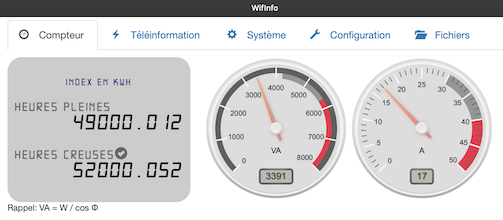
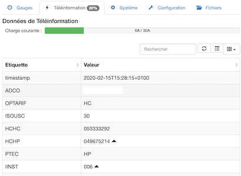
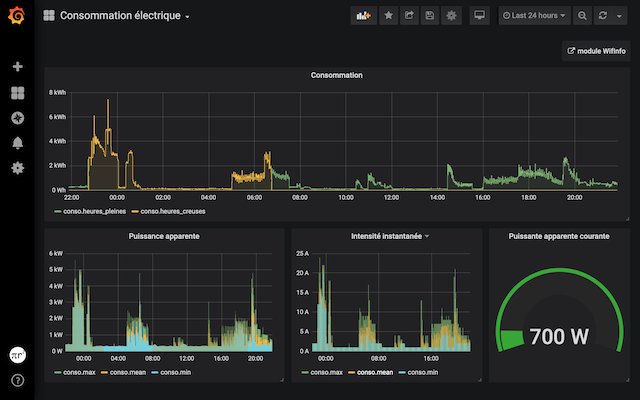
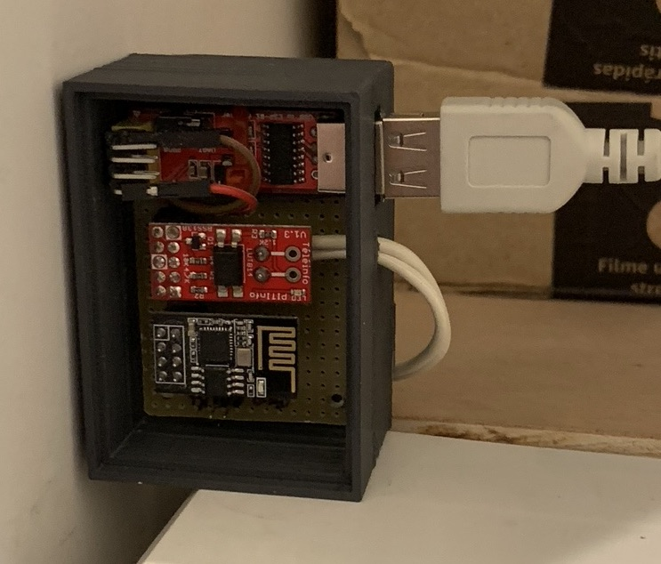

# WifInfo

WifInfo est un module de consignation de la téléinformation des compteurs électriques avec serveur web embarqué.

## Introduction

Ce projet est la fusion de développements réalisés en vue du remplacement d'un [eco-devices](http://gce-electronics.com/fr/111-eco-devices) sur base de [ESP-01](https://fr.wikipedia.org/wiki/ESP8266) et de la une réécriture quasi complète - sauf la partie interface web - du projet homonyme de [C-H. Hallard](http://hallard.me) [LibTeleinfo](https://github.com/hallard/LibTeleinfo) avec des modifications notamment de [olileger](https://github.com/olileger/LibTeleinfo) et [Doume](https://github.com/Doume/LibTeleinfo).

* Meilleure séparation des fonctions dans des fichiers sources différents
* Homogénéisation du nommage, nettoyage du code source
* Minimisation des allocations mémoire (nouvelle librairie teleinfo)
* Server-sent event ([SSE](https://fr.wikipedia.org/wiki/Server-sent_events)) pour les mises à jour des index
* Notifications HTTP sur changements HC/HP et dépasssement de seuils ou ADPS
* Client en liaison série pour mise au point avec [SimpleCLI](https://github.com/spacehuhn/SimpleCLI)
* Tests sur PC avec [Google Test](https://github.com/google/googletest) et couverture avec [lcov](http://ltp.sourceforge.net/coverage/lcov.php)
* Client Python de simulation [cli.py](tools/cli.py) sur base de `miniterm.py` de [pyserial](https://pyserial.readthedocs.io/)
* Compression et minimisation de la partie web avant écriture du filesystem (`data_src` ⇒ `data` au moment du build)
* Serveur Python [Flask](https://www.palletsprojects.com/p/flask/) pour développement de la partie web
* Exemple de stack [InfluxDB](https://www.influxdata.com) + [Grafana](https://grafana.com) pour la visualisation des données (avec sonde Python et client SSE)
* Utilisation de [PlatformIO](https://platformio.org) comme environnement de développement

La mise à jour OTA et les notifications jeedom/emoncms ne sont pas testées.

## Références

Documentation Enedis sur la [téléinformation client](https://www.enedis.fr/sites/default/files/Enedis-NOI-CPT_02E.pdf) pour les compteurs électroniques et pour les compteurs [Linky](https://www.enedis.fr/sites/default/files/Enedis-NOI-CPT_54E.pdf).

Module [PiTInfo](https://hallard.me/pitinfov12/) et explications pourquoi le montage avec uniquement optocoupleur et résistances ne suffit pas avec un esp8266.

## Interface web

### Affichage des jauges PAPP et IINST (en temps réel)



### Affichage de données de téléinformation



### Configuration des requêtes HTTP

Les requêtes HTTP sont de type GET.

Il y a 4 déclenchements possibles:
* périodique
* lors d'un changement de période tarifaire (exemple passage de HP à HC)
* lors de dépassement d'un seuil haut ou retour à un seuil bas (en VA, test avec la valeur PAPP)
* présence de l'étiquette ADPS (Avertissement de Dépassement de Puissance Souscrite)

L'URI est constituée avec les étiquettes de téléinformation (`ADCO`, `HCHC`, `HCHP`, `PTEC`, `PAPP`, `IINST`, etc.) ainsi que des étiquettes internes:
* date : date au format ISO8601 (ex: 2020-02-02T12:12:00+0100)
* timestamp : temps en secondes (Unix epoch)
* chipid : l'identifiant de l'esp8266 sous forme hexadécimale (0x0011AA)
* type : type de déclenchement (`MAJ`: périodique, `PTEC`: changement tarif, `HAUT`: seuil haut, `BAS`: retour seuil bas, `ADPS`: dépassement, `NORM`: fin dépassement)

La syntaxe pour utiliser les étiquettes est au choix:
* `$NOM`
* `~NOM~`

Exemple: `/update.php?ptec=$PTEC&conso=~HCHC~+~HCHP~&id=$chipid` ⇒ `/update.php?ptec=HP&conso=4000+3000&id=0x0011AA`

### Données JSON

* http://wifinfo/json : téléinformation sous forme de dictionnaire JSON
* http://wifinfo/tinfo.json : téléinformation sous forme de tableau JSON, utilisé par l'onglet Téléinformation de l'interface
* http://wifinfo/system.json : état du système, utilisé par l'onglet Système de l'interface
* http://wifinfo/config.json : état du système, utilisé par l'onglet Configuration de l'interface
* http://wifinfo/wifiscan.json : liste des réseaux Wi-Fi, utilisé par l'onglet Configuration de l'interface
* http://wifinfo/spiffs.json : liste des fichiers, utilisé par l'onglet Fichiers de l'interface

### Autres requêtes

* http://wifinfo/reset : permet de redémarrer le module
* http://wifinfo/version : retourne la version (tag git) du système de fichiers

### Client SSE

Le événements SSE sont accessibles via deux URL: http://wifinfo/tic ou http://wifinfo/sse/tinfo.json, avec une limitiation à deux clients simultatnés.

La donnée est la trame de téléinformation au format JSON, comme http://wifinfo/json.

Elle est envoyée à chaque réception de trame depuis le compteur.

## Compilation

Le projet est prévu pour PlatformIO sous macOS ou Linux, en conjonction avec [Visual Studio Code](https://code.visualstudio.com) et son extension [PlatformIO](https://marketplace.visualstudio.com/items?itemName=platformio.platformio-ide).

L'IDE d'Arduino peut également être utilisé.

La page HTML est compressée avec [html-minifier](https://github.com/kangax/html-minifier) et gzip.


### Options de compilation

* `DEBUG` : active la sortie sur le port série TX et vitesse 115200. Non utilisable avec un compteur, il faut utiliser le client de test pour injecter des trames.
* `ENABLE_CLI` : active les commandes par port série (`TAB` ou `ESC`)
* `DISABLE_LED` : désactive l'utilisation de LED pour les cartes qui n'en ont pas
* `ENABLE_OTA` : rajoute le code pour les mises à jour OTA **(non testé)**

Nota: Sans l'option `DEBUG`, le port série est réglé à 1200 7E1 en RX uniquement. Il y a suffisamment d'outils de mise au point pour ne pas à devoir tester avec un compteur ou un autre microcontrôleur qui simule la téléinformation.

### PlatformtIO

Avec PlatformIO (soit ligne de commandes, soit extension Visual Studio Code):

```bash
platformio run -t uploadfs
platformio run -t upload
```

### IDE Arduino

Cf. les nombreux tutos pour l'utilisation d'esp8266-arduino et l'upload de SPIFFS. Il sera aussi nécessaire de rajouter la librairie SimpleCLI.

Le répertoire `data` est préparé à l'aide du script suivant (nécessite python3, gzip, html-minifier) :

```bash
python3 prep_data_folder.py
```

## Client de test/mise au point

[cli.py](tools/cli.py) est un terminal série qui permet d'injecter de la téléinformation

```bash
pip3 install pyserial click
./cli.py
```

Pour activer le mode commande (si compilé avec l'option `ENABLE_CLI`), il faut taper <TAB> ou <ESC> puis la commande (ls, config, time, esp, ...).

* `Ctrl-T` envoie une trame de téléinformation
* `Ctrl-Y` bascule l'envoi automatique de trames
* `Ctrl-P` bascule entre heures creuses et heures pleines
* `Ctrl-C` sort du client

[sse.py][tools/sse.py] est un client SSE. Lorsque WifInfo a un client connecté, il envoie toutes les trames reçues du compteur sur cette socket.

```bash
pip3 install sseclient click
./sse.py
```

## Tests unitaires

Sans Docker:
```bash
mkdir -p build && cd build
cmake .. -DCODE_COVERAGE=ON -DCMAKE_BUILD_TYPE=Debug
make
make test
```
L'installation de certains outils et librairies est nécessaire.

Avec Docker (tout est packagé dans l'image Docker):
```bash
docker build -t tic .
docker run --rm -ti -v $(pwd):/tic:ro -v $(pwd)/coverage:/coverage tic /tic/runtest.sh
```

La couverture est disponible dans `./coverage/index.html`.

## Développement web

### Avec module simulé (aucun esp8266 requis)

```bash
pip3 install flask flask-cors
python3 tools/srv.py
```
L'interface est alors disponible à cette adresse: [http://localhost:5000/](http://localhost:5000/).

### Avec module et partie web sur PC

[nginx](http://nginx.org/en/) est utilisé en reverse proxy pour accéder aux pages dynamiques du module.

```bash
tools/httpdev.sh [adresse IP du module]
```
L'interface alors sera disponible à cette adresse: [http://localhost:5001/](http://localhost:5001/), avec les requêtes dynamiques redirigées vers le module (qui doit donc être opérationnel et joignable).


## Dashboard Grafana

La mise en place d'une stack sonde/InfluxDB/Grafana est grandement simplifiée grâce à Docker.

Le fichier [docker-compose.yaml](dashboard/docker-compose.yaml) rassemble les trois services:
* la sonde, écrite en Python, qui récupère les données en JSON via une connexion SSE avec le module
* la base de données InfluxDB de type TSBD
* Grafana pour la visulation des données

Il faudra configurer dans Grafana la source de données (http://influxdb:8086) et la database (teleinfo).

Le dashboard donné en exemple est celui créé par [Antoine Emerit](https://www.kozodo.com/blog/techno/article.php?id=32).

On peut en créer facilement selon ses propres besoins ou envies.

```bash
docker-compose up -d
```

Le dashboard sera alors accessible à cette adresse: [http://localhost:3000/](http://localhost:3000/).



## Montage

Le montage final utilise un ESP-01S avec le module [PiTInfo](http://hallard.me/pitinfov12-light/) - à acheter sur [tindie](https://www.tindie.com/products/Hallard/pitinfo/). L'alimentation est assurée par un module USB.



## Technologies utilisées

### Développement
* [Visual Studio Code](https://code.visualstudio.com)
* [PlatformIO](https://platformio.org)
* [PlatformIO IDE](https://marketplace.visualstudio.com/items?itemName=platformio.platformio-ide)
* [Node.js](https://nodejs.org/en/)
* [html-minifier](https://github.com/kangax/html-minifier) : Javascript-based HTML compressor/minifier

### Tests unitaires
* [Docker](https://www.docker.com) ou [Docker Desktop](https://www.docker.com/products/docker-desktop)
* [CMake](https://cmake.org)
* [Google Test](https://github.com/google/googletest) : Google Testing and Mocking Framework
* [nlohmann json](https://github.com/nlohmann/json) : JSON for Modern C++
* [lcov](http://ltp.sourceforge.net/coverage/lcov.php) : front-end for GCC's coverage testing tool gcov

### Client de test/injecteur de téléinfo
* [Python3.6+](https://www.python.org)
* [pyserial](https://pypi.org/project/pyserial/) : Python Serial Port Extension

### Développement web
* [Python3.6+](https://www.python.org)
* [Flask](https://pypi.org/project/Flask/) : A simple framework for building complex web applications.
* [Flask-Cors](https://pypi.org/project/Flask-Cors/) : A Flask extension adding a decorator for CORS support

### Développement web/vrai module
* [Docker](https://www.docker.com) ou [Docker Desktop](https://www.docker.com/products/docker-desktop)
* [nginx](http://nginx.org) dans un [conteneur](https://hub.docker.com/_/nginx)

### Client SSE
* [Python3.6+](https://www.python.org)
* [sseclient](https://pypi.org/project/sseclient/) : Python client library for reading Server Sent Event streams.
* [click](https://pypi.org/project/click/) : Composable command line interface toolkit

### Dashboard Grafana+InfluxDB
* [Docker](https://www.docker.com) ou [Docker Desktop](https://www.docker.com/products/docker-desktop)
* [Docker Compose](https://docs.docker.com/compose/)
* [Grafana](https://grafana.com) dans un [conteneur](https://hub.docker.com/r/grafana/grafana) Docker
* [InfluxDB](https://www.influxdata.com) dans un [conteneur](https://hub.docker.com/_/influxdb) Docker
* sonde Python
    - Python3 dans un [conteneur](https://hub.docker.com/_/python) Docker
    - [sseclient](https://pypi.org/project/sseclient/) : Python client library for reading Server Sent Event streams.
    - [click](https://pypi.org/project/click/) : Composable command line interface toolkit
    - [influxdb](https://pypi.org/project/influxdb/) : InfluxDB client

## Licence

Compte-tenu de la diversité d'origine des sources, ce travail est publié avec la licence de [WifInfo](https://github.com/hallard/LibTeleinfo/tree/master/examples/Wifinfo) sauf mention contraire.

<div align="center">

[](http://creativecommons.org/licenses/by-nc-sa/4.0/)

</div>

Ce(tte) œuvre est mise à disposition selon les termes de la [Licence Creative Commons Attribution - Pas d’Utilisation Commerciale - Partage dans les Mêmes Conditions 4.0 International](http://creativecommons.org/licenses/by-nc-sa/4.0/).

This work is licensed under a [Creative Commons Attribution-NonCommercial-ShareAlike 4.0 International License](http://creativecommons.org/licenses/by-nc-sa/4.0/).
